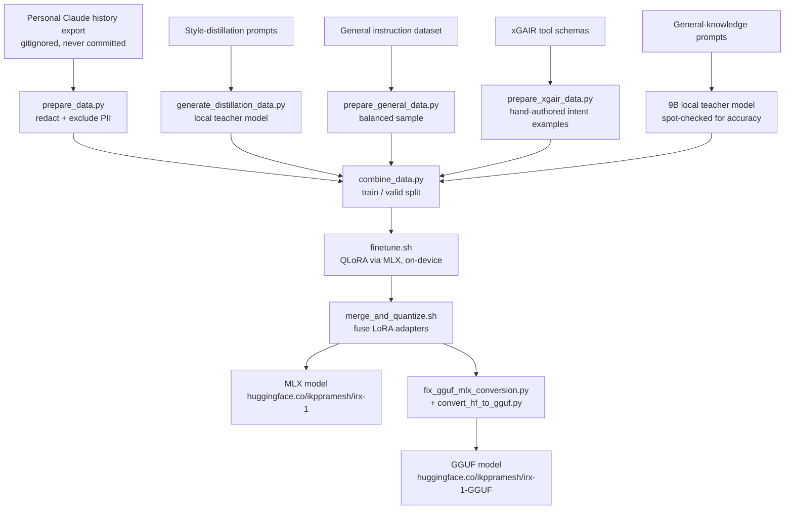
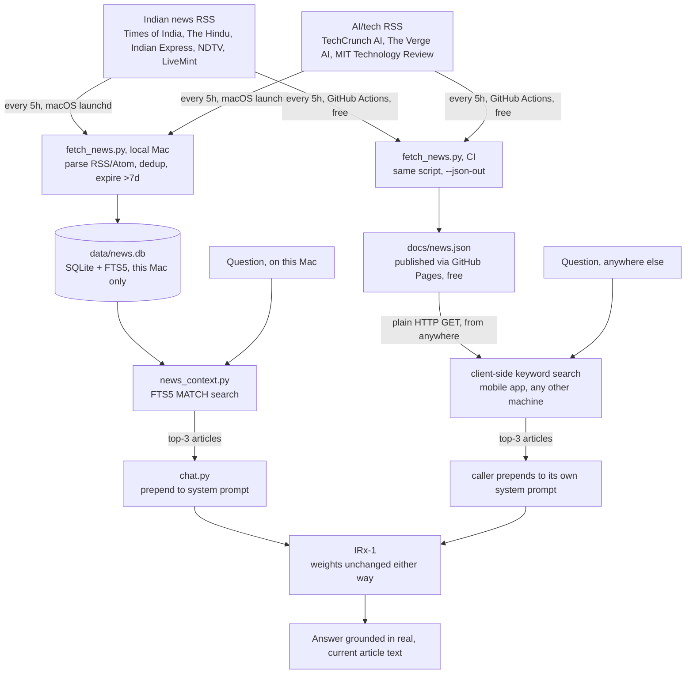

<div align="center">


**A ~2B parameter chat model, fine-tuned for fast, private, fully offline use on personal devices.**

[](https://huggingface.co/ikppramesh/irx-1)
[](https://huggingface.co/ikppramesh/irx-1-GGUF)
[](docs/LICENSE_NOTE.md)
[](https://github.com/ml-explore/mlx-lm)

</div>

---

## What is IRx-1?

IRx-1 is a small, self-contained language model built end-to-end on a single Apple
Silicon Mac — no cloud GPUs, no massive pretraining run. It's fine-tuned (LoRA/QLoRA)
from an open-weight ~2B base model on a deliberately mixed dataset: personal
conversation history for style, a public instruction dataset for general-purpose
Q&A breadth, and hand-authored data teaching it to serve as the natural-language
front-end for a real developer tool ([xGAIR](https://github.com/ikppramesh/XGAIR)).

The result runs entirely on-device — quantized to 4-bit, no internet connection
required at inference time — while still being genuinely useful for everyday tasks.

**[→ Try it on Hugging Face](https://huggingface.co/ikppramesh/irx-1)**

## Strengths

- **Fast and lightweight** — small enough to run offline on a phone or laptop
- **Private by design** — nothing you type ever leaves the device
- **Personalized style** — fine-tuned on real conversational data, not generic
  boilerplate
- **Broad everyday usefulness** — Q&A, writing help, planning, explanations,
  brainstorming, classification, summarization
- **Tool-aware** — can parse free-form natural language into structured commands for
  a real integrated developer tool (see [xGAIR integration](#real-world-integration-xgair))

## Limitations

- Not a frontier-scale model — won't match large hosted models on hard multi-step
  reasoning, deep technical/coding problems, or breadth of world knowledge; that gap
  is a function of parameter count and pretraining scale, not something fine-tuning
  erases
- Not current-events aware — its knowledge is fixed as of training, with no live or
  retrieval-based access to recent news, prices, or events
- Like any small model, occasional repetitive or off answers at higher sampling
  temperatures; regenerating usually resolves it
- **Don't enable native tool/function-calling in chat apps** (LM Studio, Bionic,
  similar). The base architecture supports a native `<tool_call>` function-calling
  format, but fine-tuning never trained on or reinforced it — a host app exposing
  tools/functions to the model can cause it to misfire the wrong tool for a plain
  question, or produce output that breaks the app's parser. Verified: the same query
  answered cleanly with no tools registered, but misfired a call to an irrelevant
  dummy tool when one was present. If you see a "failed to parse tool call" error,
  turn off tool/function-calling for this model.

## Quick start

```bash
pip install mlx-lm
```

```python
from mlx_lm import load, generate

model, tokenizer = load("ikppramesh/irx-1")

messages = [
    {"role": "system", "content": "Respond directly with only your final answer. "
     "Do not show your reasoning, planning, drafts, or a step-by-step thinking process."},
    {"role": "user", "content": "How do I convert Celsius to Fahrenheit?"},
]
prompt = tokenizer.apply_chat_template(
    messages, add_generation_prompt=True, tokenize=False, enable_thinking=False
)
print(generate(model, tokenizer, prompt=prompt, max_tokens=200))
```

The system prompt matters — without it the model can surface visible "thinking"
narration instead of a direct answer. Sample at a non-zero temperature (e.g.
`temp=0.7`); greedy decoding (`temp=0`) is prone to repetition loops on a model
this size.

## How it was built



1. **Personal data** (`scripts/prepare_data.py`) — a claude.ai conversation export is
   parsed into instruction/response pairs, each capped to a 6-message context window.
   Before training, every message is scrubbed for credentials, API keys, tokens,
   connection strings, and PII via regex — and, since regex can't safely catch
   everything (full names in non-Latin scripts, birth/health/identity details), entire
   conversation topics are excluded rather than partially redacted, verified with a
   full-text scan across the whole export, not just conversation titles.
2. **Style distillation** (`scripts/generate_distillation_data.py`) — a separate local
   model is prompted over ~50 diverse everyday prompts with reasoning-narration
   suppressed, producing a clean formatting/quality baseline.
3. **General knowledge breadth** (`scripts/prepare_general_data.py`) — a balanced
   400-example sample across 8 task categories from
   [databricks-dolly-15k](https://huggingface.co/datasets/databricks/databricks-dolly-15k)
   (CC-BY-SA-3.0, human-written, not AI-generated).
4. **Tool-use skill** (`scripts/prepare_xgair_data.py`) — 69 hand-authored examples
   teaching IRx-1 to parse free-form language into structured tool calls for xGAIR's
   chat router, grounded directly in xGAIR's actual tool schemas, not freely
   generated. An earlier version also included ~10 "general knowledge about xGAIR"
   Q&A examples — dropped after testing showed they weren't enough signal to
   reliably override the base model's existing prior on the term (it hallucinated,
   confusing "xGAIR" with an unrelated real acronym). Fact-injection via light
   fine-tuning is unreliable; the intent-parsing task is a narrower, structured
   mapping that's actually learnable at this data scale, and testing confirms it.
5. **Broader factual coverage** — a stronger local model
   ([Qwen3.5-9B](https://huggingface.co/Qwen/Qwen3.5-9B), same architecture family as
   the base model, run purely as a teacher — never merged, since weight merging across
   different-sized/architecture models isn't possible) generated 88 general-knowledge
   Q&A examples (geography, science, history), spot-checked for accuracy. This directly
   improves factual answers within that set of examples; it does not make the model
   broadly, reliably accurate on arbitrary facts outside its training data — that
   remains bounded by parameter count, not something more data fully closes.
6. **Fine-tuning** (`scripts/finetune.sh`) — QLoRA (4-bit base + LoRA adapters on 4
   layers), via [MLX](https://github.com/ml-explore/mlx-lm), entirely on a single
   Apple Silicon machine.
7. **Merge & quantize** (`scripts/merge_and_quantize.sh`) — LoRA adapters fused back
   into the base weights for a single self-contained checkpoint, exported to GGUF
   for llama.cpp-based runtimes (see below).
8. **Serve** (`scripts/serve.sh`, `scripts/chat.py`) — an OpenAI-compatible local HTTP
   API or an interactive terminal chat, both fully offline.

## GGUF / on-device via llama.cpp

[](https://huggingface.co/ikppramesh/irx-1-GGUF)

A stock `mlx_lm.convert` → `llama.cpp convert_hf_to_gguf.py` pipeline produces a
GGUF that **loads without error but generates complete garbage** — silently broken,
not obviously broken. Found by directly diffing every tensor between the raw HF
checkpoint and MLX's converted output (`scripts/fix_gguf_mlx_conversion.py` has the
full story in its docstring):

1. **`conv1d.weight` layout** — MLX stores it as (out, kernel, in); llama.cpp
   expects PyTorch's (out, in, kernel). Affects all 18 linear-attention layers'
   core recurrent-state computation. Verified: transposing MLX's version back
   reproduces the raw checkpoint's values exactly.
2. **RMSNorm weight offset** — the raw checkpoint uses the Gemma-style
   zero-centered convention (actual multiplier = 1 + weight); MLX adds the 1.0
   internally for its own kernel and that shifted value is what gets exported.
   Affects 61 tensors. Verified the same way.

Both silent, structural bugs in `mlx_lm.convert`'s Qwen3.5 support — not anything
specific to this fine-tune. Fixed before conversion, plus `--no-mtp` (this
checkpoint doesn't carry Qwen3.5's optional multi-token-prediction head).
Result verified generating coherent, correct output. GGUF build:
[ikppramesh/irx-1-GGUF](https://huggingface.co/ikppramesh/irx-1-GGUF).

## Current-events awareness: retrieval, not retraining

IRx-1's weights are fixed at training time — like any fine-tuned small model, it
can't reliably learn new facts by being retrained on them (verified directly this
project: fine-tuning on correct facts doesn't reliably override an existing wrong
belief, and news is the worst case for that — dense with fast-changing, precise
facts). So this doesn't retrain the model at all. Instead:



Two parallel paths, same source data, same underlying logic — the difference
is just where the search happens and how the data reaches it. The left path
(SQLite + FTS5) only works on this Mac. The right path (static JSON) works
from anywhere with an HTTP client, including a phone — but nothing calls it
automatically; a client (like a mobile app) has to actually fetch the URL and
do its own keyword search, using the example code below.

- `scripts/fetch_news.py` — pulls Indian news feeds (Times of India, The Hindu,
  Indian Express, NDTV, LiveMint) plus AI/tech feeds (TechCrunch AI, The Verge AI,
  MIT Technology Review — chosen for the same reason as news generally: AI model
  releases go stale faster than almost any fact category, so baking "current SOTA
  model" into weights would be wrong within months) into a local SQLite full-text
  index, on a schedule (`scripts/com.irx1.newsfetch.plist`, macOS launchd, every
  5 hours) — pure data ingestion, safe to automate. Handles both RSS 2.0 and Atom
  (The Verge publishes Atom, not RSS — different XML shape, both parsed).
- `scripts/news_context.py` — at answer-time, searches that index for articles
  relevant to the question and hands them to the model as context, with an
  explicit instruction to prefer retrieved text over (outdated) internal memory
- `scripts/chat.py` uses this automatically (disable with `--no-news`)

**Verified working well for narrow, specific questions** — e.g. "what did
TechCrunch report about Meta's AI model recently?" answered correctly, grounded
in the actual retrieved article. **Verified NOT reliable for broad, open-ended
questions** — "what are the latest AI models released?" still fell back to
hallucinating stale, made-up model names from frozen training-time memory, even
after strengthening the instruction to prefer retrieved content. This held even
though relevant articles were actually retrieved — a 2B model juggling the
identity system prompt + grounding instruction + retrieved text together doesn't
reliably prioritize all of it, similar to the Bionic tool-overwhelm finding
earlier. Ask specific questions, not "list everything about X."

Deliberately **not** automated end-to-end into "retrain and push to Hugging
Face automatically" — that would risk shipping degraded or hallucination-prone
model versions to a public repo with no human review. Model updates (new
training data, new fine-tuning rounds) stay a deliberate, reviewed step.

### Using this from anywhere — mobile, or anyone else's system

`data/news.db` only ever exists on the Mac it was built on — it's not part of
the model weights or the GGUF file, so a mobile app (or anyone else who
downloaded the model) has no access to it by default. Rather than stand up a
paid always-on API server, [`.github/workflows/fetch-news.yml`](.github/workflows/fetch-news.yml)
runs the same `fetch_news.py` on a schedule via GitHub Actions (free for public
repos) and publishes a JSON snapshot through GitHub Pages (free static
hosting) — no server, no hosting cost, no uptime to maintain:

```
https://ikppramesh.github.io/irx-1/news.json
```

Any client — a mobile app, a script on someone else's laptop, anything that can
make an HTTP GET request — fetches that file directly and searches it locally,
the same keyword-matching approach as `scripts/news_context.py`:

```javascript
const resp = await fetch("https://ikppramesh.github.io/irx-1/news.json");
const { articles } = await resp.json();

function relevantArticles(query, articles, limit = 3) {
  const stopwords = new Set(["the","a","an","is","are","was","were","what","who",
    "when","where","why","how","did","does","do","in","on","at","to","of","for",
    "and","or","with","about","tell","me","please"]);
  const terms = (query.toLowerCase().match(/[a-z0-9]+/g) ?? [])
    .filter(w => !stopwords.has(w) && w.length > 2);
  if (!terms.length) return [];

  return articles
    .map(a => ({ article: a, score: terms.filter(t =>
      (a.title + " " + a.summary).toLowerCase().includes(t)).length }))
    .filter(x => x.score > 0)
    .sort((a, b) => b.score - a.score)
    .slice(0, limit)
    .map(x => x.article);
}

const matches = relevantArticles(userQuestion, articles);
const context = matches.length
  ? "Your training data is outdated for recent events, and you have no reliable " +
    "internal knowledge of them. Answer using ONLY the articles below. If they " +
    "don't contain enough to answer, say so directly instead of guessing from " +
    "memory. Recent articles:\n" +
    matches.map(a => `- [${a.source}] ${a.title}: ${a.summary}`).join("\n")
  : "";

const systemPrompt = baseSystemPrompt + (context ? "\n\n" + context : "");
```

**Known gap:** Indian Express returns HTTP 403 from GitHub Actions' datacenter
IPs (works fine locally) — legitimate anti-bot behavior on their end, not
worked around. The published snapshot has 7 of 8 sources; the local Mac index
has all 8. Verified working end-to-end: the workflow runs, publishes real
article data, and the URL above serves it.

## Real-world integration: xGAIR

[xGAIR](https://github.com/ikppramesh/XGAIR) is an MCP (Model Context Protocol) server
that plugs AI coding assistants into any GitHub repo with structured, context-aware
development intelligence. Its chat CLI matched only exact command syntax (regex).
IRx-1 now serves as an optional natural-language fallback: free-form input that
doesn't match an exact pattern is parsed by IRx-1 (running locally, fully offline)
into the correct structured tool call.

**Real, verified outputs** (repo names not seen verbatim in training, to check it
generalizes rather than just memorizing examples):

```
> hook up github.com/vercel/next.js
  → xgair_connect_repo { url: "github.com/vercel/next.js", repo: "next.js" }

> run discovery on stripe/stripe-node
  → xgair_discover_repo { repoId: "stripe/stripe-node" }

> check this snippet: DROP TABLE users;
  → xgair_validate { repoId: "", codeSnippet: "DROP TABLE users;" }

> what repos are connected right now
  → xgair_list_repos {}
```

**Known limitation:** when a repo reference is embedded mid-sentence rather than at
the start of the message (e.g. "there's a broken redirect in vercel/next.js, fix it"),
`repoId` sometimes comes back empty even though the tool choice itself is correct.
Occasionally an off-topic message gets mapped to a tool call instead of the expected
`{"tool": "unknown"}`. Neither is catastrophic by design: the real integration falls
back to the current-repo context when `repoId` is empty, and a wrongly-triggered call
is a harmless read, not a destructive action — see `dispatchParsedIntent` in xGAIR's
`router.ts`. Two rounds of expanding/rebalancing the training data measurably improved
this; further gains would likely need meaningfully more data or LoRA capacity than the
current memory-safe training config allows.

See xGAIR's README, "Stage 2b — Natural-Language Fallback via IRx-1", for the full
integration.

## Project structure

```
IRx-1/
├── data/
│   ├── raw/              # personal export — gitignored
│   ├── processed/        # generated training JSONL — gitignored
│   └── seed_prompts.txt  # style-distillation seed prompts
├── docs/
│   └── LICENSE_NOTE.md   # license/attribution details for all training data sources
├── models/                # trained weights — gitignored (published to Hugging Face instead)
├── scripts/
│   ├── prepare_data.py            # personal history → redacted training data
│   ├── generate_distillation_data.py
│   ├── prepare_general_data.py    # databricks-dolly-15k sample
│   ├── prepare_xgair_data.py      # xGAIR intent-parsing training data
│   ├── combine_data.py            # merge all sources → train/valid split
│   ├── finetune.sh                # QLoRA fine-tune
│   ├── merge_and_quantize.sh      # fuse adapters, export GGUF
│   ├── fix_gguf_mlx_conversion.py # fixes 2 silent MLX→GGUF export bugs
│   ├── serve.sh                   # local OpenAI-compatible API
│   ├── serve_no_tools.py          # proxy: strips tool-calling for clients that force it
│   ├── fetch_news.py              # RSS -> SQLite FTS index (retrieval, not training data)
│   ├── news_context.py            # queries the index for chat.py's RAG context
│   ├── com.irx1.newsfetch.plist   # macOS launchd job: run fetch_news.py every 5h
│   └── chat.py                    # interactive terminal chat
└── requirements.txt
```

## Setup

```bash
git clone https://github.com/ikppramesh/irx-1.git
cd irx-1
uv venv --python 3.11 .venv && source .venv/bin/activate
uv pip install -r requirements.txt
```

Model weights aren't in this repo (too large for git, and Hugging Face is the right
home for them) — pull the published model directly:

```bash
python3 scripts/chat.py --model ikppramesh/irx-1
```

To reproduce training, you'll need your own `data/raw/conversations.json`
(claude.ai → Settings → Account → Export data) — everything downstream is scripted.

## Changelog

**2026-09-08**
- Added a fully automated recurring pipeline (`scripts/retrain_and_publish.sh`,
  `com.irx1.retrain.plist`, same 5h interval as the news fetch): each cycle
  turns the freshest ~20 articles into a small rolling training set
  (`generate_news_training_data.py`, overwritten not accumulated), retrains,
  rebuilds both the MLX and GGUF artifacts, and republishes both Hugging Face
  repos unattended. Explicitly requested with the tradeoff disclosed up front:
  retraining does not reliably teach the model new facts (see below and the
  model card) — the real current-events path stays retrieval. First run
  caught and fixed a real bug worth recording: `mlx_lm.fuse`'s `--save-path`
  silently overwrites `README.md` with its own auto-generated stub, which
  briefly wiped the curated model card and re-added a `base_model`/
  `license_link` referencing Qwen on the public repo — exactly what an
  earlier decision here said never to expose. Fixed by backing up and
  restoring the README around every fuse call, and by pinning the GGUF
  repo's upload filename so repeated runs overwrite in place instead of
  accumulating duplicate files under different names.
- Wired news retrieval directly into the reference mobile app (`irai`):
  RNFS-cached JSON, keyword-scored retrieval mirroring the app's existing
  memory system, refreshed automatically on launch plus a manual refresh
  control in Settings — "refresh" now means re-fetching a small JSON file,
  never re-downloading the model.
- Made news retrieval portable beyond this Mac: GitHub Actions runs the fetch
  on a schedule and publishes a JSON snapshot via GitHub Pages (both free) —
  any client, including a mobile app, can now fetch and search it with no
  server and no local Python/SQLite setup. Verified live and serving real data.
- Extended the news RAG with AI/tech feeds (TechCrunch AI, The Verge AI, MIT
  Technology Review) so IRx-1 can discuss recent AI-model-landscape news the
  same way it does other current events — added Atom feed parsing (The Verge
  publishes Atom, not RSS) and a stronger grounding instruction. Honestly
  documented: works well for narrow questions, not reliable for broad
  "list everything" questions even after the fix (see above)
- Removed base-model references from public model cards (no more Model Tree
  linkage, no license link naming the base) — kept a generic Apache 2.0
  declaration only
- Added a creator-identity system prompt instruction — consistently attributes
  the model to its creator when asked, tested across phrasings ("who made you",
  "tell me about yourself", etc.)
- Added the news RAG pipeline above — RSS → SQLite FTS index, refreshed every
  5h via launchd, retrieved per-question at answer-time; model weights untouched
- Fixed GGUF export: found and fixed two silent bugs in the MLX→GGUF conversion
  path (a conv1d weight axis-order mismatch, and an RMSNorm weight offset
  convention mismatch) that together produced a file which loaded without error
  but generated complete garbage. Verified working GGUF published.

**2026-09-07**
- Added a general-knowledge fine-tuning round using a locally-run larger model
  as teacher (88 spot-checked geography/science/history examples) — verified a
  genuine but partial accuracy improvement, not a full fix (documented honestly
  in Limitations, including facts that stayed wrong)
- Hardened the tool-calling-bypass proxy: overrides any system prompt a client
  injects, caps `max_tokens` as a backstop against runaway generation
- Documented the tool/function-calling limitation — host apps that expose
  tools/functions to the model can trigger misfired tool calls or an
  unterminated hallucinated agentic loop
- Rebalanced the xGAIR intent-parsing training data (32 → 69 examples) after
  finding an earlier small "general knowledge about xGAIR" factual set was
  unreliable and caused hallucination; dropped it, focused entirely on the
  structured intent-parsing task, which the data scale actually supports
- Initial commit: personal-history + general-QA + distillation data pipeline,
  QLoRA fine-tuning scripts, first published model card

## License

Apache 2.0. IRx-1 is a derivative fine-tune of an open-weight base model, plus data
from databricks-dolly-15k (CC-BY-SA-3.0). Full attribution and lineage details in
[`docs/LICENSE_NOTE.md`](docs/LICENSE_NOTE.md).
